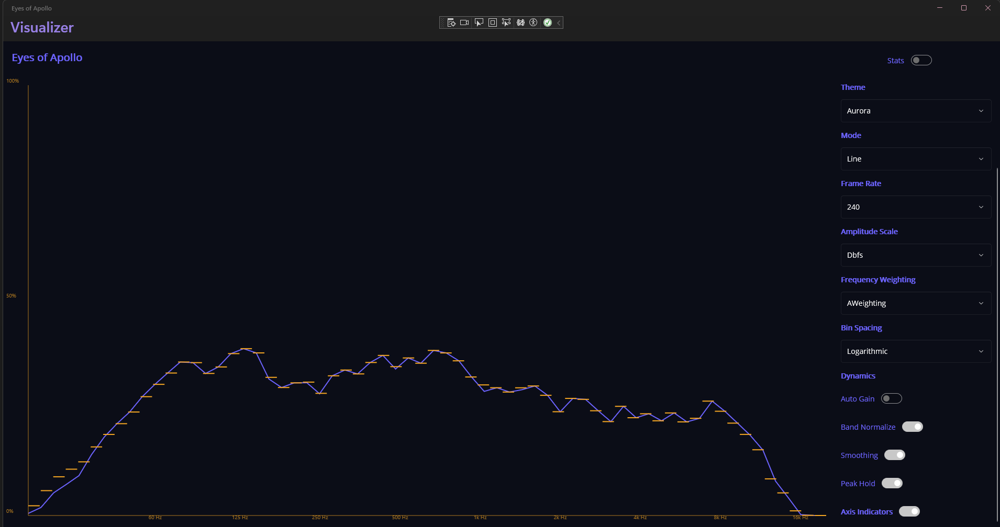

# MWG.EyesOfApollo

Eyes of Apollo is a .NET MAUI audio visualizer focused on perceptual clarity, low latency, and clean customization. It visualizes both input and output devices and keeps the experience tuned for how people actually hear.

## Features
- Input/output device visualization
- Logarithmic frequency binning for perceptual balance
- Multiple visualizer modes (bars/line)
- Theme-driven styling with JSON themes
- Optional stats/latency overlay
- Configurable frame rates (30–240 Hz)

## Usage
1. Build and run the app.
2. Select an audio device (input or output).
3. Choose visualizer mode, weighting, and bin mode.
4. Customize theme and optional overlays.

## Documentation
- Roadmap: `docs/roadmap.md`
- See the `docs` directory for technical details as they are added.
- GitHub Pages (placeholder): `https://<org-or-user>.github.io/<repo>/`
